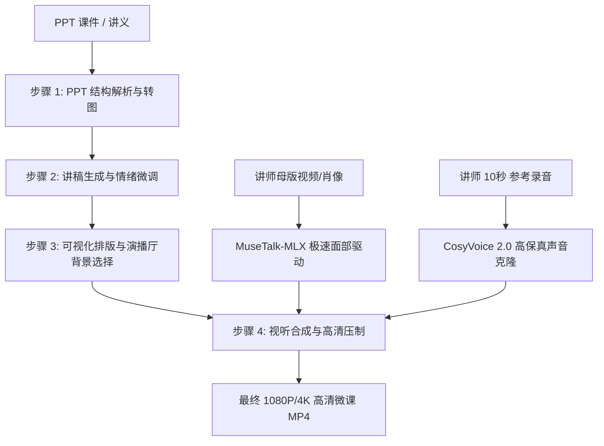

# Mac Digital Human - PPT 授课数字人微课制作平台

专为 **Apple Silicon（M 系列芯片，推荐 M2/M3/M4/M5）** 设计的本地全链路数字人微课制作与驱动平台。

结合 **MuseTalk-MLX 本地硬件加速口型驱动** 与 **CosyVoice 2.0 高保真零样本声音克隆**，将 PPT 课件一键转换为包含专业讲师出镜、自然语音、自由拖拽排版与自动字幕的高清授课微视频。全程本地运算，数据与隐私绝对安全。

---

## 🌟 核心特色与生产架构



### 生产组件明细

| 组件 | 核心引擎 | 作用与优势 |
| :--- | :--- | :--- |
| ⚡ **数字人口播驱动** | **MuseTalk 1.5 MLX** | 基于 Apple Silicon 深度硬件加速，几秒到十秒级即时驱动讲师母版视频，口型自然精准、无画质闪烁。 |
| 🎙️ **高保真声音克隆** | **CosyVoice 2.0 (0.5B)** | 零样本音色克隆，音质自然饱满无机械感；支持微课情绪注入与标点自适应停顿。 |
| 🎨 **课件可视化自由排版** | **Course Composer** | 支持双视窗排版、PPT 居左/居右、画中画、画布任意拖拽缩放比例及演播厅背景库替换。 |
| 🎬 **视听压制与字幕打包** | **FFmpeg + Subtitles Pipeline** | 自动对齐语音分段、压制高清中文字幕、智能背景音乐混音与无损渲染。 |

---

## 💻 硬件与环境要求

- **操作系统**：macOS 14.0+ (Sonoma / Sequoia)
- **计算芯片**：Apple Silicon（M1 / M2 / M3 / M4 / M5 系列芯片）
- **统一内存 (Unified Memory)**：
  - 基础体验：16 GB
  - 推荐生产：24 GB / 36 GB / 48 GB 或更高
- **磁盘空间**：建议保留至少 15 GB 剩余空间（用于存放 MuseTalk 与 CosyVoice 模型权重及工作区缓存）
- **基础依赖工具**：Homebrew, uv, ffmpeg, git

---

## 🚀 极简安装与部署步骤

### 1. 克隆代码仓库

```bash
git clone https://github.com/wudanwt/mac-digital-human.git
cd mac-digital-human
```

### 2. 一键安装环境与下载模型

项目内置自动化安装脚本，会自动配置 Python 3.11 虚拟环境、安装核心依赖、拉取 MLX 硬件加速模块并自动下载所有模型权重：

```bash
bash scripts/setup.sh
```

> **说明**：
> - 脚本会自动从 HuggingFace / ModelScope 下载 **MuseTalk MLX** 权重与人脸解析模型；
> - 脚本会自动调用 `scripts/setup_tts.sh` 下载 **CosyVoice 2.0 0.5B** 语音克隆权重；
> - 本地若已存在相应权重文件，脚本会自动跳过重复下载。

### 3. 环境与模型就绪检测

安装完成后，可执行自检命令验证硬件与模型状态：

```bash
# 检测 MuseTalk 数字人引擎就绪状态
.venv/bin/python scripts/check_runtime.py

# 检测 CosyVoice 2.0 语音克隆引擎就绪状态
.venv/bin/python scripts/check_tts.py
```
> 当返回均为 `ready: true` 时，表示所有本地驱动已就绪。

---

## 🖥️ 启动与使用指南

### 1. 启动 Web 交互平台（推荐）

运行启动脚本：

```bash
bash scripts/run_web.sh
```

打开浏览器访问 **`http://127.0.0.1:8918`** 即可进入微课制作工作台。

---

### 2. 四步制作 PPT 数字人微课

1. **第 1 步：上传课件**
   - 拖拽或选择上传本地 `.pptx` 课件；
   - 系统自动解析幻灯片，提取每页文字要点并渲染高清页面底图。
2. **第 2 步：讲稿审阅与情绪配置**
   - 查看系统提炼的各页讲解台词；
   - 可自由修改每页讲稿文本，支持添加自然停顿标点（如逗号、破折号），系统会自动适配生动的微课演讲语速。
3. **第 3 步：个性化机位排版与背景选择**
   - **推荐版式**：一键切换“PPT 居左 + 人物居右”、“画中画悬浮”或“微课全屏”；
   - **自由拖拽**：直接在交互画布上拖拽 PPT 或讲师窗口，支持自由缩放大小与精确定位；
   - **演播厅背景**：内置科技蓝调演播室、暖色木质讲堂、深色商务会议室等预设背景，并支持自定义上传背景图片。
4. **第 4 步：视听打包与成片导出**
   - 选择背景音乐音量与字幕开关；
   - 点击“开始制作微课视频”，实时查看语音合成、口型渲染与画音混剪进度条；
   - 制作完成后可在线预览播放，并一键下载 1080P/4K 高清 MP4 视频。

---

### 3. 讲师库管理与个性化声音克隆

在工作台点击顶部导航 **“讲师库与克隆音色”**：
- **添加讲师**：
  1. 上传一张讲师正面肖像照或一段无杂音的母版口播视频（MP4/MOV）；
  2. 录制或上传一段 5~30 秒清晰朗读的人声音频，并填入准确逐字台词；
  3. 系统将基于 CosyVoice 2.0 自动提取声学音色特征，生成专属高保真讲师音色。
- **动态母版口播**：配置了母版视频的讲师，生成微课时不仅唇形精准匹配，还能保留真实的头部微动与眼神流转。

---

### 4. 命令行 CLI 生成微课（适合批量构建）

除了 Web 界面，您也可以通过命令行运行微课生成：

```bash
# 运行完整的微课脚本构建
bash scripts/run_lecture.sh
```

或者单独测试 MuseTalk 极速口型驱动：

```bash
bash scripts/run_avatar.sh --video samples/master.mp4 --audio samples/voice.wav
```

---

## 🔒 隐私保护与模型隔离说明

- **模型权重不进仓库**：
  - 所有深度学习模型权重（包括 5.2GB 的 CosyVoice 2.0 与 MuseTalk 权重）已全部加入 `.gitignore`，不会随 Git 同步；
  - 外部克隆项目后，通过官方脚本 `bash scripts/setup.sh` 即可安全下载模型。
- **人脸与声音隐私保护**：
  - 用户上传或录制的真实讲师人脸母版（`profiles/assets/`）、克隆录音文件（`digital-human-tts/voices/`）以及本地生成的私有人设数据默认被 Git 排除，绝不泄漏至公共代码托管平台。

---

## 📂 项目工程目录结构

```text
mac-digital-human/
├── app/                        # 核心微课制作与调度服务
│   ├── composer.py             # 视听画面布局排版、画中画合成与 FFmpeg 压制
│   ├── engines/                # 视频驱动引擎包 (MuseTalk-MLX)
│   ├── lecture.py              # 微课流水线主控 (解析->TTS->口型驱动->合成)
│   ├── main.py                 # FastAPI Web 后端服务与交互式 UI
│   ├── ppt/                    # PPT 解析与渲染引擎
│   ├── subtitles.py            # 字幕时间戳对齐与 ASS/SRT 压制
│   └── tts/                    # 语音引擎层 (CosyVoice 2.0 生产适配)
├── digital-human-tts/          # CosyVoice 2.0 高保真语音克隆模块
│   ├── tts_core/               # 文本规整、长文本切分与流式/批处理合成核心
│   └── vendor/CosyVoice/       # CosyVoice 官方推理代码
├── profiles/                   # 讲师预设与人设配置 (隐私素材已忽略)
├── scripts/                    # 自动化运维脚本
│   ├── setup.sh                # 一键安装环境与准备双引擎权重
│   ├── setup_models.py         # MuseTalk 权重下载
│   ├── setup_tts_models.py     # CosyVoice 2.0 权重下载
│   ├── check_runtime.py        # 硬件与视频运行时状态检测
│   ├── check_tts.py            # 语音克隆运行时状态检测
│   ├── run_web.sh              # 启动 Web 交互平台
│   └── run_lecture.sh          # 命令行一键生成微课
├── tests/                      # 自动化测试用例 (pytest)
└── pyproject.toml              # 项目依赖与 Python 打包配置
```

---

## 🧪 运行自动化测试

```bash
.venv/bin/pytest tests/
```
覆盖排版布局、PPT 解析、微课流程编排、讲师人设管理与 CosyVoice 2.0 注册表等核心单元测试。

---

## 📄 开源许可证

本项目核心编排系统遵循 Apache-2.0 协议开源；所调用的下游模型（MuseTalk、CosyVoice 2.0）遵循其各自的开源许可证协议。请勿将生成的数字人内容用于任何虚假欺诈或违反法律法规的用途。
